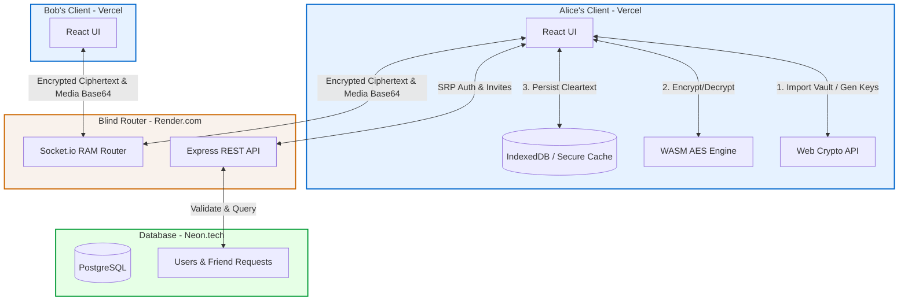
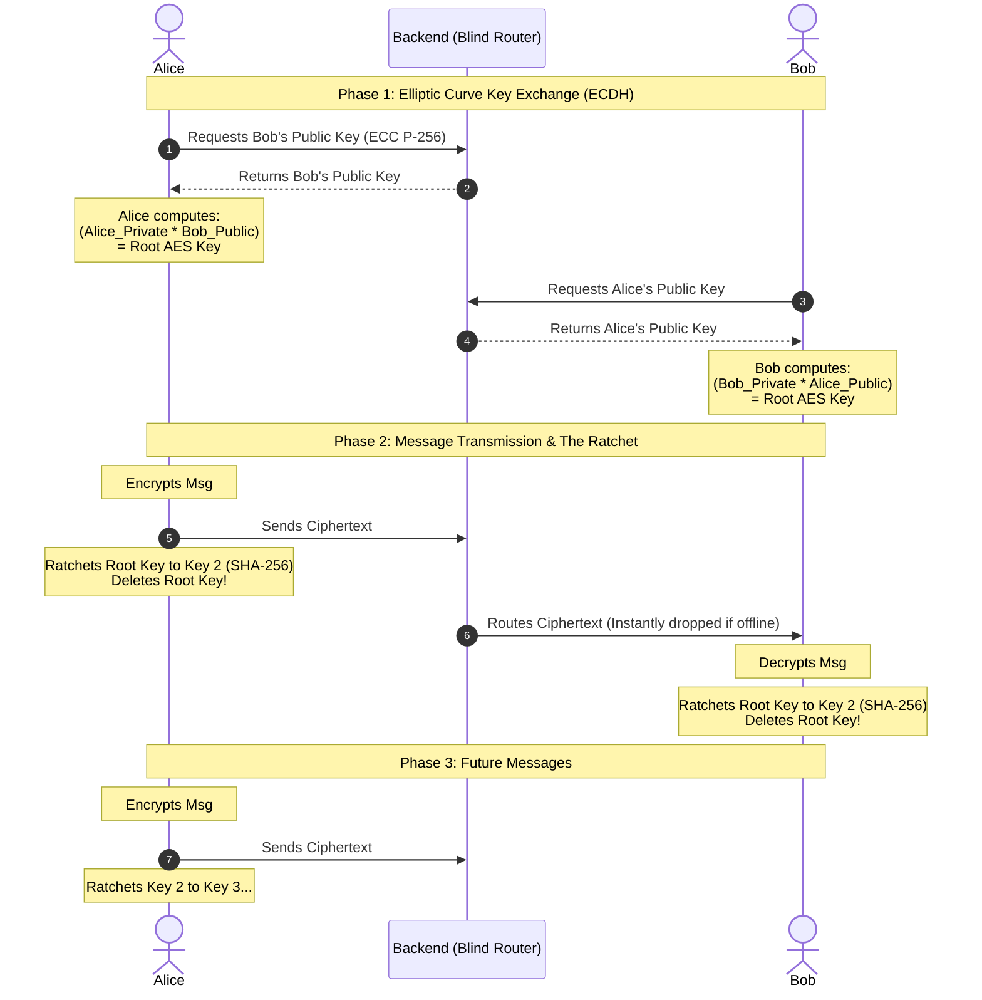
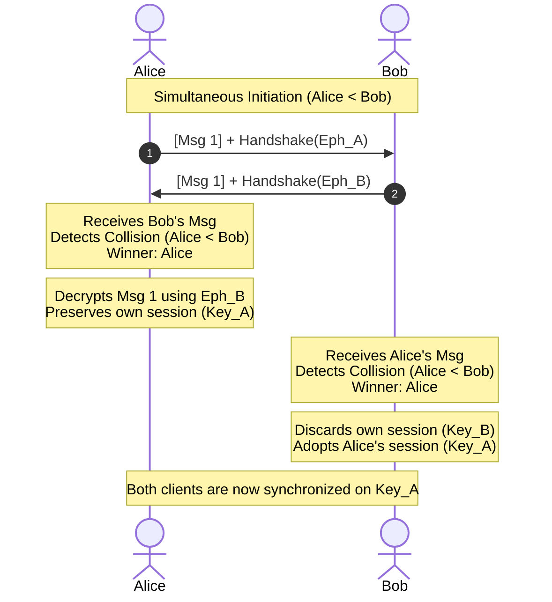

# 🛡️ Project Krypt: Mathematically Verified E2EE Chat

**Project Krypt** is a military-grade, End-to-End Encrypted (E2EE) real-time messaging application. It is designed with a strictly "Zero-Trust" and "Zero-Footprint" architecture: the server never knows your password, never sees your encryption keys, and immediately drops messages upon delivery. 

It features **Zero-Knowledge Proof authentication (SRP-6a)**, **Physical Vault Identities**, **Elliptic Curve Key Exchange (ECDH)**, **Perfect Forward Secrecy (via a SHA-256 Ratchet)**, and **High-Performance Symmetric Encryption** using a custom C++ WebAssembly engine.

-## 🗺️ System Architecture

### 1. High-Level Infrastructure
The following diagram outlines the complete flow of data between the Vercel-hosted React clients, the Render-hosted Express WebSocket router, and the Neon Serverless PostgreSQL database.



### 2. The ECDH & Ratchet Flow (Perfect Forward Secrecy)
This sequence diagram illustrates how Alice and Bob derive a shared AES key using Elliptic Curve Cryptography, and how the SHA-256 Ratchet destroys keys after every message to ensure forward secrecy.



---

## 🛠️ Tech Stack

### Frontend (The Client Vault)
- **Framework:** React + Vite + TypeScript
- **State & Logic:** Custom React Hooks
- **Cryptography:** Native Web Crypto API (`window.crypto.subtle`), custom C++ WASM (for heavy AES-256 media encryption), `secure-remote-password` (SRP).
- **Session Management:** Physical `.vault` files, `sessionStorage` (Volatile Tab Cache), and `localStorage` (Encrypted Key Cache).
- **Local Database:** `dexie` (IndexedDB) for persistent, client-side message storage.
- **Styling:** Tailwind CSS.
- **Hosting:** Vercel

### Backend (The Blind Router)
- **Framework:** Node.js + Express + TypeScript
- **Real-time & Media Routing:** Socket.io (Pure Memory Routing for text and large Base64 media).
- **Database ORM:** Prisma
- **Database:** PostgreSQL (Hosted on Neon.tech via Connection Pooling)
- **Security:** `helmet`, strict CORS.
- **Hosting:** Render.com

---

## 📂 Project Directory Structure
The application is organized into a frontend React application and a backend Node.js router:

### Frontend (`frontend/src/`)
```plaintext
src/
├── components/         # UI Elements
│   ├── LoginForm.tsx   # Handles SRP ZK-Proof Auth UI & Vault Uploads
│   ├── Sidebar.tsx     # Social Wall, Friend Requests, Search
│   ├── ChatWindow.tsx  # Main message rendering
│   └── ImagePreview.tsx# Image lightbox and zoom preview
├── hooks/              # Custom React Logic
│   ├── useAuth.ts      # SRP Handshake & Vault Restoration Logic
│   ├── useSocketListeners.ts # WebSocket listeners
│   ├── useChat.ts      # Message handling & E2EE flow
│   ├── useSocial.ts    # Friend management & social state
│   └── useRatchet.ts   # SHA-256 Ratchet management
├── crypto/             # The Cryptographic Engines
│   ├── aes_wasm.ts     # C++ compiled WebAssembly AES-256-GCM engine
│   ├── ecc.ts          # Elliptic Curve generation & ECDH Key Mixing
│   └── ratchet.ts      # SHA-256 One-Way hash ratchet
├── services/           # External Connections
│   ├── socket.ts       # Socket.io singleton instance
│   ├── db.ts           # Dexie (IndexedDB) configuration
│   └── wasmLoader.ts   # WebAssembly runtime initializer
└── App.tsx             # Main layout and provider wrapper
```

### Backend (`primary-backend/src/`)
```plaintext
src/
├── api.ts              # Express REST endpoints (Auth, Search, Friends, Revoke)
├── server.ts           # Socket.io router and HTTP server setup
└── db.ts               # Prisma client initialization
```

---

## 🧮 Cryptographic Evolution & Theorems
This application was built in iterative phases, transitioning from legacy standards to modern, mathematically verified security lifecycles.

### 1. Zero-Knowledge Proofs (Secure Remote Password - SRP-6a)
- **The Problem:** Sending a password to a server leaves it vulnerable to database leaks or MITM attacks.
- **The Theorem:** Instead of sending a password, Alice uses her password to solve a massive mathematical puzzle generated by the server.
- **Implementation:** The server stores a Salt and a mathematical Verifier. When Alice logs in, she mixes an Ephemeral Key with the server's Challenge. If the math checks out, she is authenticated without the actual password string ever leaving her RAM.

### 2. Identity Genesis & The Physical Vault
- **The Protocol:** During registration, the client generates a permanent ECC P-256 KeyPair. The public key serves as the global "Identity Certificate."
- **Physical Custody:** The Private Key is exported as a physical `.vault` file to the user's hard drive. The server never sees the Private Key.

### 3. Secure Auto-Restoration (Tab Refreshing)
- **The Problem:** If a user refreshes the page, RAM is cleared. Forcing them to re-upload their `.vault` file on every refresh is poor UX.
- **Implementation:** During login, the session password is saved to volatile `sessionStorage` (dies when the tab closes). The `.vault` Private Key is encrypted with this password and cached in `localStorage`. On refresh, the app uses the `sessionStorage` password to silently decrypt the `localStorage` cache back into RAM.

### 4. Elliptic Curve Diffie-Hellman (ECDH Key Mixing)
- **The Theorem:** In Elliptic Curve math, a Public Key is just a Private Key multiplied by a public Base Point ($G$).
- **Implementation:** Alice takes her Private Key and mathematically multiplies it by Bob's Public Key: `(Private_A * Public_B)`. Bob does the exact same with Alice's Public Key: `(Private_B * Public_A)`. Because multiplication is commutative, they both independently arrive at the exact same Root AES Key.

### 5. Perfect Forward Secrecy (The SHA-256 Ratchet)
- **The Problem:** Using the same AES key forever means a future device theft compromises the entire past chat history.
- **Implementation:** Immediately after sending/receiving a message, the app runs the Root AES Key through a SHA-256 one-way hash function to create the next key, permanently deleting the old key.

### 6. Handshake Collision Resolution (Deterministic Tie-Breaking)
- **The Problem:** In a truly decentralized E2EE system, if two users send their first message at the exact same millisecond, they both try to be the "Initiator" with different ephemeral keys. This leads to a state mismatch.
- **The Theorem:** Use a deterministic tie-breaker that requires zero network communication. 
- **Implementation:** Both clients compare usernames alphabetically. The lexicographically smaller username (e.g., "Alice" < "Bob") is designated the "Winner." The winner's ephemeral key becomes the root of the session. The loser detects the collision, discards their own initiation attempt, and adopts the winner's key.



### 7. Pure Memory Routing & WASM Encryption
- **The Problem:** Asymmetric math (ECC) is designed for tiny payloads. It cannot encrypt large files without crashing the browser, and saving temporary files to a server disk leaves a forensic trail.
- **Implementation:** A custom C++ WebAssembly engine handles heavy AES-256-GCM symmetric encryption on the client. The resulting encrypted blobs (Image/Audio) are transmitted as massive Base64 strings directly over the WebSocket. The backend server acts as a "Blind Router," holding the payload strictly in RAM for routing and immediately clearing it from memory. Zero disk footprint.

---

## 🚀 Development Roadmap & Architectural Phases
This project was intentionally built in distinct phases to validate each layer of the security architecture.

- **Phase 1: Zero-Knowledge Identity:** Implemented SRP-6a. The database was secured to only store `srpSalt` and `srpVerifier`.
- **Phase 2: The Blind Router:** Built the Express WebSocket router to handle real-time delivery without reading payloads.
- **Phase 3: Asymmetric Prototype (RSA):** Successfully implemented standard RSA-2048 E2EE. (Later deprecated for ECC).
- **Phase 4: Client-Side Persistence:** Migrated decrypted message storage exclusively to the client's local IndexedDB using `dexie`.
- **Phase 5: Rich Media via Pure RAM Routing:** Integrated C++ WASM engines to handle heavy AES image/audio encryption, transmitting payloads directly over WebSockets to avoid backend disk writes.
- **Phase 6: The Social Wall:** Built a robust Friend Request database schema (with instant Socket revocation via `request_revoked`) to prevent unauthorized payload spam.
- **Phase 7: The Cryptographic Upgrade:** Stripped out legacy RSA. Upgraded the platform to Elliptic Curve Diffie-Hellman (ECDH) and the SHA-256 Double-Ratchet.
- **Phase 8: Nuclear Logout & Identity Vaults:** Transitioned to strict zero-footprint. Added `.vault` file exports, `sessionStorage` auto-restoration, and the "Nuclear Logout" mechanism to completely wipe IndexedDB and Local/Session storage.
- **Phase 9: Cloud Deployment:** Hardened Express with `helmet` and strict CORS. Deployed the PostgreSQL database to Neon, the API to Render, and the React client to Vercel.

---

## 💻 How to Run Locally

### 1. Clone the Repository
```bash
git clone https://github.com/yourusername/project-cipher.git
```

### 2. Setup the Database (Backend)
- Create a local PostgreSQL database (or use Neon.tech).
- Create a `.env` file in the `primary-backend` folder and add:
```env
DATABASE_URL="your_postgresql_connection_string"
DIRECT_URL="your_direct_connection_string"
```
- Run Prisma migrations:
```bash
cd primary-backend
npm install
npx prisma db push
```

### 3. Start the Backend
```bash
npm run dev
```

### 4. Start the Frontend
- Open a new terminal.
```bash
cd frontend
npm install
npm run dev
```

The app will be running at `http://localhost:5173`.

---

*Developed as an Advanced Security & Cryptography Capstone Project.*

## 📜 License
This project is licensed under the MIT License - see the [LICENSE](LICENSE) file for details.

---

### 🎓 Acknowledgments
**Minor project under the supervision of Dr. Sonal Chandel Ma'am**  
*Department of Computer Science & Engineering*

**Developed by:**
- **Anchal Jain** (Scholar Number: 23U02144)
- **Abhinav Singh Senger** (Scholar Number: 23U02142)