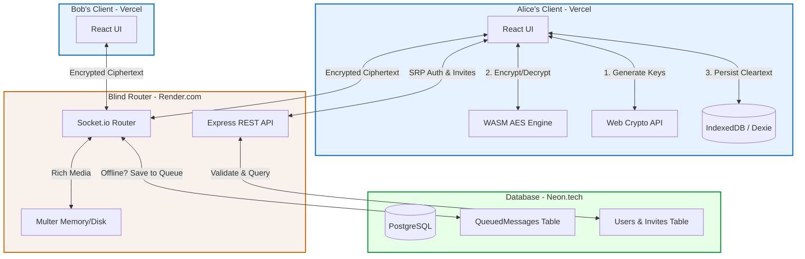
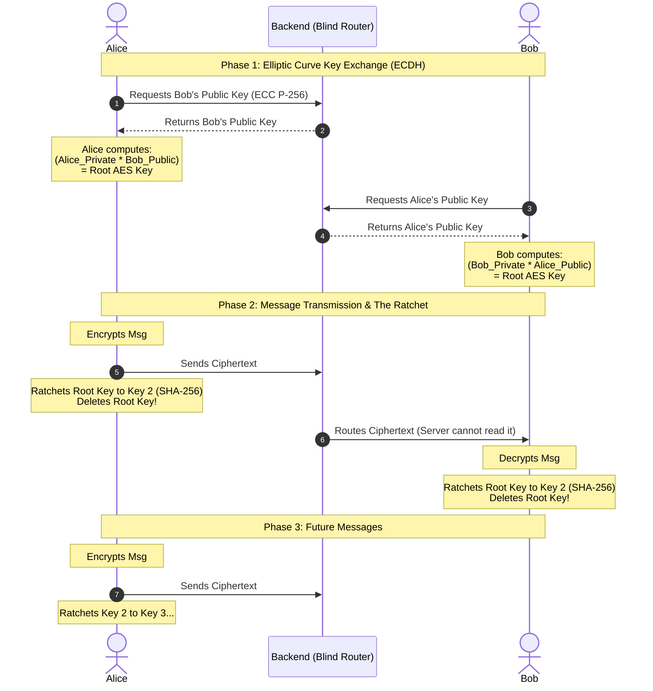

# 🛡️ Project Cipher: Mathematically Verified E2EE Chat

**Project Cipher** is a military-grade, End-to-End Encrypted (E2EE) real-time messaging application. It is designed with a strictly "Zero-Trust" architecture: the server never knows your password, never sees your encryption keys, and immediately deletes messages upon delivery. 

It features Zero-Knowledge Proof authentication, Elliptic Curve Key Exchange (ECDH), Perfect Forward Secrecy (via a SHA-256 Ratchet), and High-Performance Symmetric Encryption using a custom C++ WebAssembly engine.

---

## 🗺️ System Architecture

### 1. High-Level Infrastructure
The following diagram outlines the complete flow of data between the Vercel-hosted React clients, the Render-hosted Express WebSocket router, and the Neon Serverless PostgreSQL database.



### 2. The ECDH & Ratchet Flow (Perfect Forward Secrecy)
This sequence diagram illustrates how Alice and Bob derive a shared AES key using Elliptic Curve Cryptography without ever transmitting the key, and how the SHA-256 Ratchet destroys keys after every message to ensure forward secrecy.



---

## 🛠️ Tech Stack

### Frontend (The Client Vault)
- **Framework:** React + Vite + TypeScript
- **State & Logic:** Custom React Hooks
- **Cryptography:** Native Web Crypto API (`window.crypto.subtle`), custom C++ WASM (for heavy AES-256 media encryption), `secure-remote-password` (SRP).
- **Local Database:** `dexie` (IndexedDB) for persistent, client-side message storage.
- **Styling:** Tailwind CSS.
- **Hosting:** Vercel

### Backend (The Blind Router)
- **Framework:** Node.js + Express + TypeScript
- **Real-time:** Socket.io
- **Database ORM:** Prisma
- **Database:** PostgreSQL (Hosted on Neon.tech via Connection Pooling)
- **File Storage:** `multer` (Temporarily stores encrypted Base64 blobs before 7-day cron wipe)
- **Security:** `helmet`, strict CORS.
- **Hosting:** Render.com

---

## 📂 Project Directory Structure
The application is organized into a frontend React application and a backend Node.js router:

### Frontend (`frontend/src/`)
```plaintext
src/
├── components/         # UI Elements
│   ├── LoginForm.tsx   # Handles SRP ZK-Proof Auth UI
│   ├── Sidebar.tsx     # Social Wall, Friend Requests, Search
│   ├── ChatWindow.tsx  # Main message rendering
│   └── ImagePreview.tsx# Image lightbox and zoom preview
├── hooks/              # Custom React Logic
│   ├── useAuth.ts      # SRP Handshake & Session Management
│   ├── useSocketListeners.ts # WebSocket listeners & offline queue sync
│   ├── useChat.ts      # Message handling & E2EE flow
│   ├── useSocial.ts    # Friend management & social state
│   └── useRatchet.ts   # SHA-256 Ratchet management
├── crypto/             # The Cryptographic Engines
│   ├── aes_wasm.ts     # C++ compiled WebAssembly AES-256-GCM engine
│   ├── ecc.ts          # Elliptic Curve generation & ECDH Key Mixing
│   └── ratchet.ts      # SHA-256 One-Way hash ratchet
├── services/           # External Connections
│   ├── socket.ts       # Socket.io singleton instance
│   ├── db.ts           # Dexie (IndexedDB) configuration
│   └── wasmLoader.ts   # WebAssembly runtime initializer
└── App.tsx             # Main layout and provider wrapper
```

### Backend (`primary-backend/src/`)
```plaintext
src/
├── api.ts              # Express REST endpoints (Auth, Search, Friends)
├── server.ts           # Socket.io router and HTTP server setup
└── db.ts               # Prisma client initialization
```


---

## 🧮 Cryptographic Evolution & Theorems
This application was built in iterative phases, transitioning from legacy Asymmetric standards to modern Elliptic Curve protocols to achieve Perfect Forward Secrecy.

### 1. Zero-Knowledge Proofs (Secure Remote Password - SRP)
- **The Problem:** Sending a password to a server (even hashed) leaves it vulnerable to database leaks or man-in-the-middle attacks.
- **The Theorem:** Instead of sending a password, Alice uses her password to solve a massive mathematical puzzle generated by the server.
- **Implementation:** We use the **SRP-6a** protocol. The server stores a Salt and a mathematical Verifier. When Alice logs in, she mixes an Ephemeral Key with the server's Challenge. If the math checks out, the server authenticates her without ever receiving the actual password string.

### 2. The Architecture Shift: Why We Replaced RSA with ECC
In the initial phases of this project, we used RSA-2048 for key exchange. Alice would generate an AES key, lock it inside an RSA "box" using Bob's Public Key, and send that locked box over the WebSocket. We explicitly ripped RSA out and upgraded to **Elliptic Curve Cryptography (NIST P-256)** for three critical reasons:
1. **Performance & Size:** RSA keys are massive (2048 bits) and mathematically heavy. ECC provides the exact same security level at a fraction of the size (256 bits), saving bandwidth and device battery life.
2. **Key Agreement vs. Key Transport:** RSA requires Key Transport (sending a locked AES key over the internet). ECC allows for Key Agreement (Diffie-Hellman), meaning the key is never transmitted.
3. **Ratchet Compatibility:** RSA is too slow to generate new key pairs for every single message. ECC's speed allows us to dynamically rotate keys, making the Ratchet possible.

### 3. Elliptic Curve Diffie-Hellman (ECDH Key Mixing)
- **The Theorem (Commutative Mathematics):** In Elliptic Curve math, a Public Key is just a Private Key multiplied by a public Base Point ($G$).
- **Implementation:** Instead of sending keys over the wire, Alice takes her Private Key and mathematically multiplies it by Bob's Public Key: `(Private_A * Public_B)`. Bob does the exact same with Alice's Public Key: `(Private_B * Public_A)`. Because multiplication is commutative, they both arrive at the exact same Root AES Key independently.

### 4. Perfect Forward Secrecy (The SHA-256 Ratchet)
- **The Problem:** If Alice and Bob use the same AES key forever, a hacker who steals Bob's phone a year from now can decrypt every past message.
- **The Theorem (Deterministic One-Way Hashing):** A cryptographic hash function (SHA-256) takes an input and produces a predictable output, but it cannot be reversed.
- **Implementation:** After a message is sent, Alice and Bob instantly run their Root AES Key through the `ratchetKey()` SHA-256 blender to create the next key. They permanently delete the old key. If a hacker steals a device, they only get the current key and cannot "un-hash" it to read historical messages.

### 5. Symmetric Authenticated Encryption (AES-256-GCM via WASM)
- **The Problem:** Asymmetric math (ECC/RSA) is designed for tiny text payloads. It cannot encrypt large files like 4MB images without crashing the browser.
- **Implementation:** We use a custom **C++ WebAssembly engine** to perform AES-256-GCM symmetric encryption. It is lightning fast, allowing us to encrypt large Base64 image strings locally in milliseconds before uploading the encrypted blob to the server.

---

## 🚀 Development Roadmap & Architectural Phases
This project was intentionally built in distinct phases to validate each layer of the security architecture before moving to the next.

- **Phase 1: Zero-Knowledge Identity:** Implemented SRP-6a. The database was secured to only store `srpSalt` and `srpVerifier`.
- **Phase 2: The Blind Router:** Built the Express WebSocket router to handle real-time delivery without terminating TLS or reading payloads.
- **Phase 3: Asymmetric Prototype (RSA):** Successfully implemented standard RSA-2048 E2EE. Validated that clients could encrypt AES keys and send them via the Socket.
- **Phase 4: Offline State Management:** Engineered the Prisma/PostgreSQL queue to cache encrypted blobs for offline users, dumping and deleting them upon reconnect.
- **Phase 5: Client-Side Persistence:** Migrated decrypted message storage from server RAM to the client's local IndexedDB using `dexie`.
- **Phase 6: Rich Media & WebAssembly:** Integrated C++ WASM engines to handle heavy AES image encryption and a `multer` pipeline for encrypted blob storage.
- **Phase 7: The Social Wall:** Built a robust Friend Request database schema to prevent cryptographic payload spam from unauthorized connections.
- **Phase 8: The Cryptographic Upgrade (ECC & Ratchet):** Stripped out the legacy RSA architecture from Phase 3. Upgraded the entire platform to Elliptic Curve Diffie-Hellman (ECDH) and implemented the SHA-256 double-ratchet for Perfect Forward Secrecy.
- **Phase 9: Cloud Deployment:** Hardened Express with `helmet` and strict CORS. Deployed the PostgreSQL database to Neon, the API to Render, and the React client to Vercel.

---

## 💻 How to Run Locally

### 1. Clone the Repository
```bash
git clone https://github.com/yourusername/project-cipher.git
```

### 2. Setup the Database (Backend)
- Create a local PostgreSQL database (or use Neon.tech).
- Create a `.env` file in the `primary-backend` folder and add:
```env
DATABASE_URL="your_postgresql_connection_string"
DIRECT_URL="your_direct_connection_string"
```
- Run Prisma migrations:
```bash
cd primary-backend
npm install
npx prisma db push
```

### 3. Start the Backend
```bash
npm run dev
```

### 4. Start the Frontend
- Open a new terminal.
```bash
cd frontend
npm install
npm run dev
```

The app will be running at `http://localhost:5173`.

---

*Developed as an Advanced Security & Cryptography Capstone Project.*

## 📜 License
This project is licensed under the MIT License - see the [LICENSE](LICENSE) file for details.

---

### 🎓 Acknowledgments
**Minor project under the supervision of Dr. Sonal Chandel Ma'am**  
*Department of Computer Science & Engineering*

**Developed by:**
- **Anchal Jain** (Scholar Number: 23U02144)
- **Abhinav Singh Senger** (Scholar Number: 23U02142)
